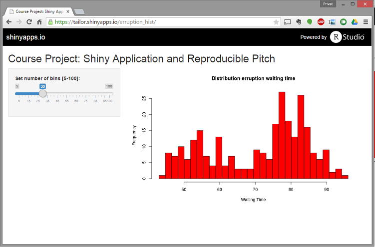
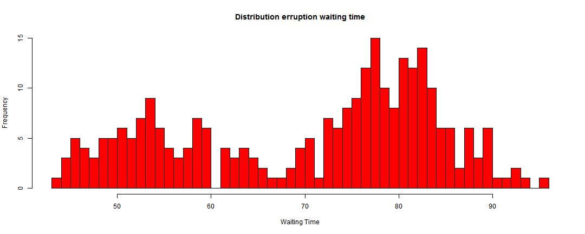

Pitch Presentation
========================================================
author: cschnider
date: 26-04-2015
font-family: 'Risque'

Shiny App
========================================================

Decription
----
This is a simple Shiny application showing dynamically histograms of erruption waiting time


How to use the application
----
Just slide the slider o the left from 5 to 100 bins
The histogram gets updated automatically


Shiny Application
========================================================

URL
--
https://tailor.shinyapps.io/erruption_hist/

Screenshot
--
 

Example histogram with 50 bins
========================================================
R Code
---

```r
#data
x    <- faithful[, 2] 
# draw the histogram 
hist(x, main="Distribution erruption waiting time", 
     ylab="Frequency",
     xlab="Waiting Time",
     breaks = 50, col = 'red', border = 'black')
```

Example histogram with 50 bins
========================================================
R Resulting Histogramm
--
 
